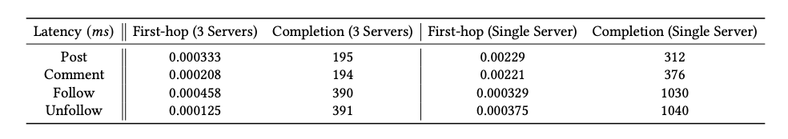
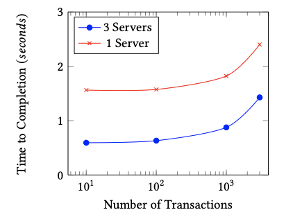

# Social Media Distributed Transaction System

## Overview 
This repository implementes a transaction system that replicates the backend of a social media system. Using SC-Graph analysis, various transactions were created and designed such that they could be called without violating ACID properties. The data was also distributed across multiple servers, further increasing the ability of the system to handle transactions simultaneously.  

## Data Tables & Transactions

The database consists of 5 distinct tables: the edge, graph, post, comment, and profile table. The profile table stores the user's primary information, such as how many posts, comments, and followers they have. The post/comment table store the content of the post/comment. The graph table is used to keep track of follower relationships, and the edge table is used to check for the existence of such follower relationships. Notably, all follow/unfollow transactions must first check the edge table for the existence of edges, which prevents SC-cycles in the graph. 

The set of predefined transactions were created for SC-graph analysis: follow, unfollow, post, and comment. Transaction chopping allowed these transactions to be split into multiple hops, with each hop operating on a different table. The first hop for post and comment accessed their respective tables to insert the associated content, and on the second hop updated the profile table. The follow and unfollow transactions included an additional initial hop that checks the edge table. If an edge is or isn't detected for the follow or unfollow operation, respectively, the operation aborts and prevents conflicts with other transactions. 

## Evaluation

To evaluate the system, 3000 unique profiles were generated, and 1000 random, predefined transactions associated with each profile were created. A set of 100 transactions was used to evaluate the average latency and throughput for each transaction, and to verify they operated correctly. Another subset of transactions of size 10, 100, 1000, and 3000 were used to evalue the system’s performance compared to a non-distributed system. The results of the system were compared to a non-distributed system, where all tables and transactions were located on a single server. 

## Results

Our system achieved improved throughput and latency compared to a non-distributed system using the same tables and transactions. The distributed system outperforms the non-distributed system in terms of throughput and latency. The tables below show the results for average latency of 100 transactions, and the time to completion for varying amounts of transactions. 

    
    

